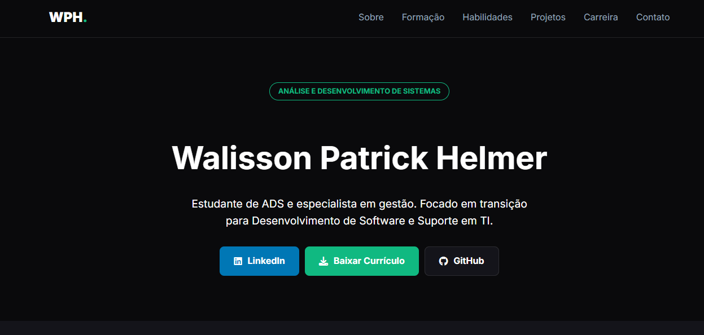
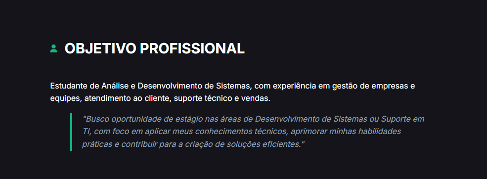
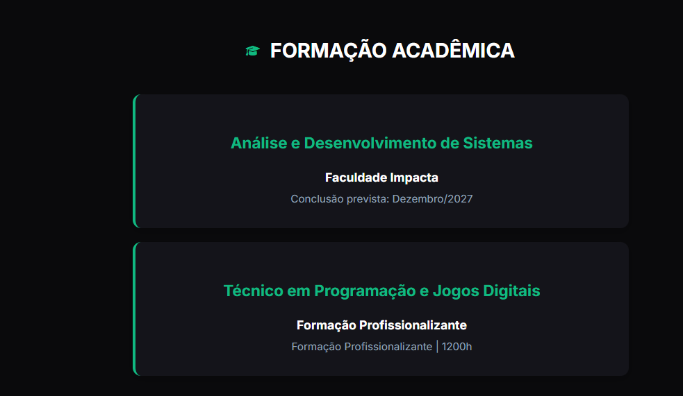
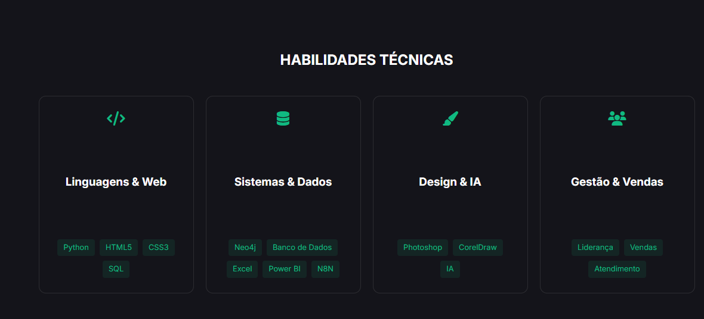

# 💻 Portfólio Profissional — Walisson Patrick Helmer

Bem-vindo ao repositório do meu **Portfólio Profissional Online**.

Este projeto foi desenvolvido para apresentar minha trajetória acadêmica, habilidades técnicas e projetos práticos de forma **moderna, responsiva e acessível**, servindo como meu currículo digital interativo.

🚀 **Acesse o portfólio online:**  
👉 https://walissonpatrickhelmer.github.io/curriculo

---

## 👨‍💻 Sobre o Projeto

O portfólio foi criado com o objetivo de centralizar minhas experiências, estudos e projetos em um único ambiente digital, permitindo que recrutadores e profissionais da área conheçam rapidamente meu perfil técnico e profissional.

O site apresenta:

- ✅ Apresentação profissional
- ✅ Formação acadêmica
- ✅ Habilidades técnicas
- ✅ Projetos desenvolvidos
- ✅ Experiência profissional
- ✅ Contato direto

Além disso, o projeto foi pensado com foco em **experiência do usuário (UX)** e **design moderno**, incluindo alternância de tema e suporte multilíngue.

---

## ✨ Funcionalidades

- 🌙 Alternância entre **Modo Claro e Escuro**
- 🌍 Suporte a **dois idiomas (PT/EN)**
- 📱 Layout totalmente responsivo
- ⚡ Navegação fluida com menu fixo
- 🎯 Design focado em recrutamento tech
- 🔗 Integração direta com LinkedIn, GitHub e currículo

---

## 🛠️ Tecnologias Utilizadas

| Tecnologia | Descrição |
|------------|-----------|
| **HTML5** | Estrutura semântica e acessível |
| **CSS3** | Flexbox, Grid Layout e variáveis de tema |
| **JavaScript** | Alternância de idioma e tema |
| **Font Awesome** | Ícones e elementos visuais |
| **Google Fonts (Inter)** | Tipografia moderna |

---

## 🧠 Conceitos Aplicados

Este projeto aplica conceitos importantes de desenvolvimento web:

- Design Responsivo (Mobile First)
- Organização semântica de layout
- Manipulação de DOM com JavaScript
- CSS Variables (Theming System)
- UX/UI para portfólio profissional
- Estrutura modular de seções

---

## 📸 Demonstração

### 🏠 Hero Section
Apresentação inicial com identidade profissional e acesso rápido às principais plataformas.

### 🎯 Objetivo Profissional
Resumo da transição de carreira e direcionamento para área de Tecnologia.

### 🎓 Formação Acadêmica
Destaque para graduação em Análise e Desenvolvimento de Sistemas e formação técnica.

### 🧩 Habilidades Técnicas
Organização visual das competências técnicas e profissionais.

---

## 📂 Estrutura do Projeto

📁 curriculo
┣ 📄 index.html
┣ 📄 style.css
┣ 📄 script.js
┗ 📁 img

---

## 🎯 Objetivo Profissional

Atualmente em transição para a área de tecnologia, busco oportunidades de:

- Estágio em Desenvolvimento de Software
- Suporte em TI
- Desenvolvimento Web
- Projetos voltados a Dados e Automação

Com experiência prévia em gestão, atendimento e liderança, trago uma visão estratégica aliada ao aprendizado técnico contínuo.

---

## 📬 Contato

📍 Belo Horizonte — MG  
📧 wpatrickhelmer@gmail.com  
📱 WhatsApp: (31) 99373-6336  

🔗 LinkedIn:  
https://www.linkedin.com/in/walissonpatrickhelmer/

🔗 GitHub:  
https://github.com/WalissonPatrickHelmer

---

## ⭐ Sobre este Repositório

Este projeto faz parte da minha jornada de evolução na área de tecnologia e aprendizado contínuo em desenvolvimento de software.

Se quiser acompanhar minha evolução, fique à vontade para:

⭐ Dar uma estrela no repositório  
👀 Acompanhar meus projetos  
🤝 Conectar-se comigo no LinkedIn

---

> “Tecnologia é transformação contínua — e este portfólio representa minha evolução.”