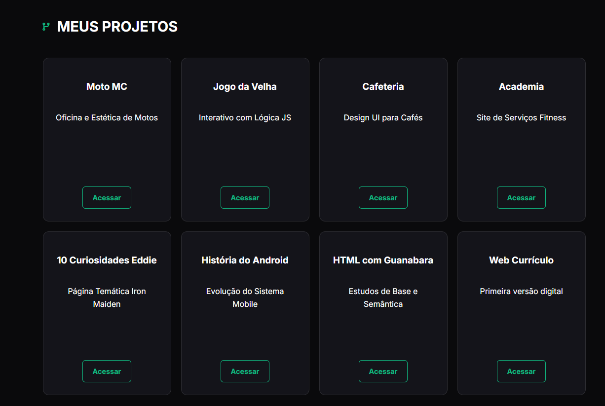
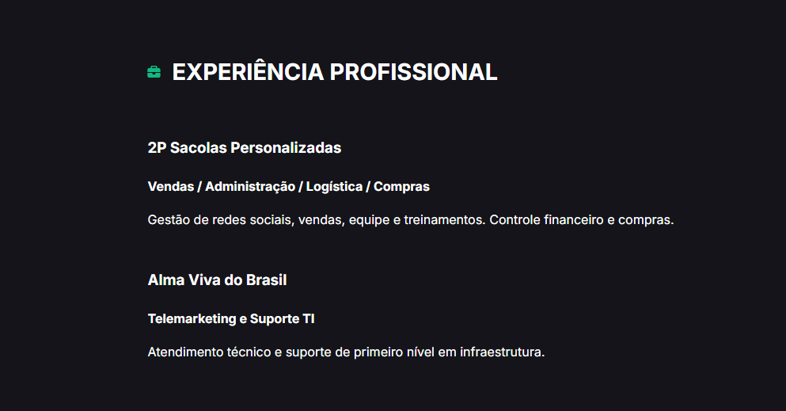
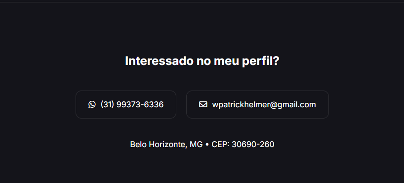

# 💻 Portfólio Profissional - Walisson Patrick Helmer

Este repositório contém o código-fonte do meu portfólio online. O projeto foi desenvolvido para apresentar minha trajetória acadêmica, habilidades técnicas e projetos práticos de forma responsiva e moderna.

🚀 **Acesse o site:** [https://walissonpatrickhelmer.github.io/curriculo](https://walissonpatrickhelmer.github.io/curriculo)

---

## 🛠️ Tecnologias Utilizadas
* **HTML5:** Estrutura semântica.
* **CSS3:** Estilização avançada com Flexbox, Grid e variáveis de tema.
* **JavaScript:** Lógica para alternância de idiomas (PT/EN) e modo escuro/claro.
* **FontAwesome:** Ícones interativos.

---

## 📸 Demonstração do Projeto

### 1. Walisson Patrick Helmer (Hero)
Seção inicial com foco no meu nome, badge de ADS, cargo atual e botões de ação para LinkedIn, GitHub e Currículo.

### 2. Objetivo Profissional
Resumo sobre minha transição de carreira e metas profissionais para as áreas de TI e Desenvolvimento.

### 3. Formação Acadêmica (Graduação)
Destaque centralizado para o curso superior de Análise e Desenvolvimento de Sistemas.

### 4. Formação Acadêmica (Técnico)
Detalhes da formação técnica profissionalizante com carga horária de 1200h.

### 5. Habilidades Técnicas
Grid de competências técnicas separadas por categorias: Linguagens, Dados, Design/IA e Gestão.

### 6. Meus Projetos
Vitrine interativa apresentando 8 projetos reais com layout de 4 colunas e botões de acesso direto.

### 7. Experiência Profissional
Linha do tempo detalhando minha atuação profissional prévia e atual.

---

## 💡 Funcionalidades de Destaque
- **Dark/Light Mode:** Interface adaptável à preferência de leitura do usuário.
- **Internacionalização:** Suporte para Português e Inglês via JavaScript.
- **Responsividade:** Layout totalmente adaptado para Celulares, Tablets e PCs.

---

## 📬 Contato
- **LinkedIn:** [walissonpatrickhelmer](https://www.linkedin.com/in/walissonpatrickhelmer/)
- **Email:** wpatrickhelmer@gmail.com
- **WhatsApp:** (31) 99373-6336

---
Desenvolvido por Walisson Patrick Helmer.